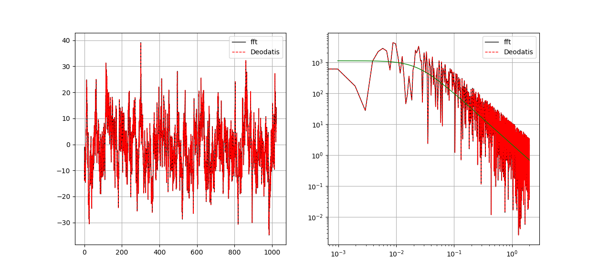
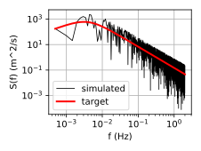
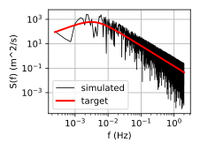
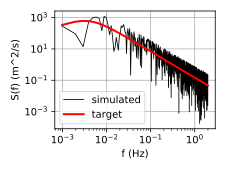
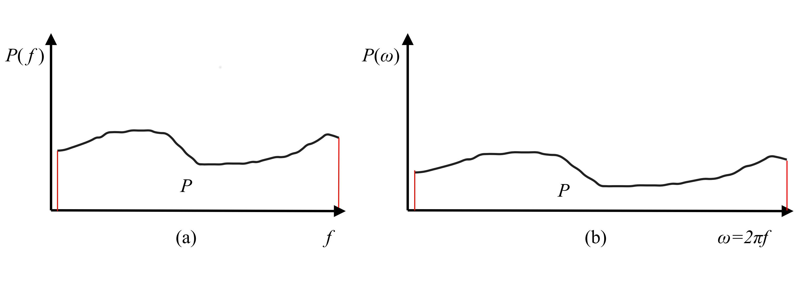

# 谐波合成法(WAWS)程序使用手册

以功率谱作为权系数，与一系列带随机相位的三角级数的加权和来逐渐逼近随机过程，适用于指定谱特征的平稳高斯随机过程。该方法有恒幅谐波叠加法和加权振幅谐波叠加法(尚未阅读相关文献). 

## 1. 谐波合成法基本步骤

**Step 1: ** 选取目标风速谱$S(w)$和相干函数$coh(x_i, x_j, y_i, y_j, z_i, z_j, f)$,确定模拟点坐标

**Step 2: **生成互谱密度矩阵
$$
S(w) = \begin{bmatrix} S_{11}(\omega) &  S_{12}(\omega)  ...  & S_{1n}(\omega) \\
				   S_{21}(\omega) &  S_{22}(\omega)  ...  & S_{2n}(\omega) \\
				   . & ........ & . \\
				   . & ........ & . \\
				   . & ........ & . \\
				   S_{n1}(\omega) &  S_{n2}(\omega)  ...  & S_{nn}(\omega) \\\end{bmatrix}\\
				   
S_{ij}(\omega)=\sqrt{ S_{12}(\omega) S_{12}(\omega)}coh(x_i,x_j,y_i,y_j,z_i,z_j,\omega)
$$

**Step 3: **对互谱密度矩阵进行cholesky分解

$$
S(w) =H(w) H^T(w)\\
H(w) = \begin{bmatrix} H_{11}(\omega) &  0 ...  & 0 \\
				   H_{21}(\omega) &  H_{22}(\omega)  ...  & 0 \\
				   . & ........ & . \\
				   . & ........ & . \\
				   H_{n1}(\omega) & H_{n2}(\omega)  ...  & H_{nn}(\omega) \\\end{bmatrix}
$$

**Step 4: (option 1):  ** M. Shinuzuka提出的单索引频率法

这种算法最简单, 只需互谱密度矩阵进行$N$次`cholesky`分解($n \times n$阶矩阵). 但是由于频率均匀分布可能导致模拟曲线出现周期性[^1]. (*具体情况尚未进行过详细地分析, 有机会在做吧, 暂且相信文献的结论*)
$$
V_j(t) = 2\sqrt{\Delta \omega} \sum_{m=1}^{j} \sum_{l=1}^{N}|H_{jm}(\omega_{l})cos(\omega_l t + \theta_{jm}(\omega_l) + \phi_{ml})\\
\omega_l = l\Delta\omega, l = 1,2,3,...,N
$$

**Step 4 (option 2): ** Deodatis双索引频率法计算模拟点风速时程

公式来源于<基于实测风特性的台风模拟>(杨素珍)[^2]
由于option 1可能存在模拟风速时程出现周期性的问题, 引入了双索引频率, 将频率微小扰量均匀分布在频率增量内, 这样既可以采用FFT算法, 又能保证模拟曲线的各态历经性. 但互谱密度矩阵的分解数量将明显提升, 达到$N \times n$次($N$为频率等分数, $n$为模拟点数), 这样运算量将会增加; (但似乎采用`numpy.linalg.cholesky()`函数计算效率并不低)
$$
V_j(t) = 2\sqrt{\Delta\omega}\sum_{m=1}^{j}\sum_{l=1}^{N}|\H_{jm}(\omega_{ml})| cos(\omega_{ml}t - \theta(\omega_{ml}) + \phi_{ml})\\
\phi_{ml}=rand[0,2\pi]\\
\theta_{jm}=arctan[\frac{Im[H_{jm}(\omega_{ml})]}{Re[H_{jm}(\omega_{ml})]}]\\
\omega_{ml} = (l-1)\Delta\omega + m/n\Delta\omega, l=1,2,3,...,N
$$
**注意:** 有的文献中将$2\sqrt{\Delta\omega}​$写成$\sqrt{2\Delta\omega}​$这是错的
**注意:** 如果$S(w)​$为实正定矩阵,则$H(w)​$也为实矩阵,因此$\theta_{jm}=0$

实际上, 在采用双索引算法时,并非$H(\omega_{ml})$矩阵中的所有元素都将用于最终的谐波叠加. 保留$H(\omega_{ml}$矩阵中用到的元素, 组成如下有效元素矩阵

$$
H^{eff}(w) = \begin{bmatrix} H_{11}(\omega_{1l}) &  0 ...  & 0 \\
H_{21}(\omega_{1l}) &  H_{22}(\omega_{2l})  ...  & 0 \\
. & ........ & . \\
. & ........ & . \\
H_{n1}(\omega_{1l}) & H_{n2}(\omega_{2l})  ...  & H_{nn}(\omega_{nl}) \\\end{bmatrix}
$$

**采用这种方式合成脉动风速需要多次累加计算, 模拟非常耗时, 尤其是当模拟点数较多时**

**Step 4 (option 3): ** 采用FFT技术加速风速时程的合成

公式都是自己推导的, 应该没有问题
实际计算过程中发现整个模拟过程中合成风速时程是比较耗时的, 而采用FFT技术可以显著提升模拟速度
$$
V_j(t) = 2\sqrt{\Delta\omega}\sum_{m=1}^{j}\sum_{l=1}^{N}|\H_{jm}(\omega)| cos(\omega_{ml}t - \theta(\omega_{ml}) + \phi_{ml})\\
$$

引入欧拉公式$e^{ix} = cosx + isinx$,且$\theta_{jm}(\omega_{wl}=0$, 上式可以改写为
$$
V_j(t) = 2\sqrt{\Delta\omega}\sum_{m=1}^{j}\sum_{l=1}^{N}|\H_{jm}(\omega_{ml})| Re[e^{i(\omega_{ml}t + \phi_{ml})}]\\
= Re[2\sqrt{\Delta\omega}\sum_{m=1}^{j}\sum_{l=1}^{N}|\H_{jm}(\omega_{ml})| e^{i\omega_{ml}t} e^{i\phi_{ml}}]\\
=Re[\sum_{m=1}^{j}(\sum_{l=1}^{N} 2 \sqrt{\Delta\omega} |H_{jm}(\omega_{ml})| e^{i\omega_{ml}t} e^{i\phi_{ml} })]
$$

代入$\omega_{ml} = (l-1)\Delta\omega + \frac{m}{n}\Delta\omega$, 上式可以改写为
$$
V_j(t) = Re[\sum_{m=1}^{j}(\sum_{l=1}^{N} 2 \sqrt{\Delta\omega} |H_{jm}(\omega_{ml})| e^{i((l-1)\Delta\omega + \frac{m}{n}\Delta\omega)t} e^{i\phi_{ml} })]\\
=Re[\sum_{m=1}^{j}(\sum_{l=1}^{N} 2 \sqrt{\Delta\omega} e^{i\phi_{ml}} |H_{jm}(\omega_{ml})| e^{i((l-1)\Delta\omega t} )e^{i\frac{m}{n}\Delta\omega t} ]\\
= Re[\sum_{m=1}^{j}G_{jm}(p\Delta t) e^{i\frac{m}{n} \Delta \omega t}]
$$

注意, 上式中括号内部分刚好是离散傅里叶逆变换的表达式
$$
G_{jm} = (\sum_{l=1}^{N} 2 \sqrt{\Delta\omega} e^{i\phi_{ml}} |H_{jm}(\omega_{ml})| e^{i(l-1)\Delta\omega t} )\\
$$

令$k = l - 1, (k=0,1,2,...,N-1)$ 且 , $B_{jm} = 2 \sqrt{\Delta\omega} e^{i\phi_{ml}} |H_{jm}(\omega_{ml})|, \Delta\omega=\frac{\omega}{N}=\frac{2\pi f}{N}$,上式可以改写为
$$
G_{jm}(p\Delta t) = (\sum_{l=1}^{N}B_{jm} e^{ik\Delta\omega t} ) = (\sum_{k=0}^{N-1}B_{jm} e^{i k \Delta \omega p\Delta t} )
$$

信号的最长周期$T_0 = \frac{2\pi}{\Delta \omega}$, 若采样时间间隔为$\Delta t$, 一个周期内的时间点数为$M = \frac{T_0}{\Delta t}$, 则
$$
T_0 = M \Delta t = \frac{2 \pi}{\Delta \omega}\\
\Delta t \Delta \omega = \frac{2 \pi}{M}
$$
带入上上式中
$$
G_{jm}(p\Delta t) = (\sum_{l=1}^{N}B_{jm} e^{ik\Delta\omega t} ) = (\sum_{k=0}^{M-1}B_{jm} e^{i kp \frac{2\pi}{M}})\\
B_{jm} = \left \{ 
\begin{aligned}
2 \sqrt{\Delta\omega} e^{i\phi_{ml}} |H_{jm}(\omega_{ml})|, 0 \leq l < N \\
0,  N \leq < l <M
\end{aligned}
\right.
$$
而离散傅里叶逆变换的表达式为$x(t) = \frac{1}{N} \sum_{n=0}^{N-1} X(n) e^{i\frac{2 \pi}{N} t n}$ 因此, 可以对$B_{jm}$进行离散傅里叶逆变换从而提高运算效率, (FFT的时间复杂度为$nlog(n)$). 

**说明1:** 在很多文献中对这部分都描述为使用FFT技术加速计算, 然而并未提及到底是使用`fft`还是`ifft`; 另一方面在网络上看到的很多代码中, 都是直接使用`fft`进行计算的. 然而, 依据上述推导过程及表达式, 显然应该使用`ifft`才比较合理; 另一方面, 从物理意义上看, `ifft`是将信号从频域转换到时域, 和$B_{jm}转换到G_{jm}$这个过程也是吻合的. 此外, 为了验证采用`ifft`的正确性, 对比了直接采用Deodatis双索引公式合成的脉动风和采用`ifft`合成的脉动风速的时程和频谱, 结果表明二者完全一致, 这足以说明采用`ifft`的正确性.

**说明2: **在很多文献[^4]中$p \Delta t, p=0,2,3,..., M*npts-1$ 生成风速的总时长都为$T=nT_0=npts*M*\Delta t$, **我没搞懂这个是怎么来的?** 在我推导的表达式中, 模拟时长$T=T_0$与模拟点数$npts$并无关系, 实际模拟的结果无论是总能量还是频谱分布都吻合, 所以这个为啥这么做?

**Step 5 (option 1): **平稳信号模拟的误差分析

完成全部模拟后, 应当对生成的信号进行误差分析, 以此判断模拟结果的精度, 误差分析应当包含如下几部分内容

1. 模拟谱与目标谱的对比, 能量分布应当吻合
   - 绘制模拟谱与目标谱的对比图片

2. 验证模拟信号是否满足各态历经性

   参考文献[^4]

   根据维纳-辛钦定理, 平稳随机过程的功率谱密度与自相关函数满足如下关系(fft变换):
   $$
   FFT: S(\omega) = \int_{-\infty}^{\infty} R(\tau) e^{-i \omega \tau} d\tau\\
   IFFT: R(\tau) = \frac{1}{2\pi} \int_{-\infty} ^{\infty} S(\omega) e^{i \omega \tau} d\omega
   $$

   - 自/互相关函数对比

   ensemble auto-/cross-correlation function
   $$
   R_{jk}^{0} (\tau) = R_{jk} (\tau) = \int_{-\infty}^{\infty} {S_{jk}^{0} (\omega) e^{i\omega \tau} d\omega}
   $$
   temporal auto-/cross-correlation fuction
   $$
   R_{jk}^{i}(\tau) = \frac{2} {T_0} \Delta \omega \sum_{m=1} ^{n} \sum_{l=0} ^{N-1} |H_{jm}(\omega_{ml})||H_{km}(\omega_{ml})| cos(\omega_{ml} \tau - \theta_{jm}(\omega_{ml}) + \theta_{km}(\omega_{ml}))\\
   R_{jk}^{i}(\tau) =E[V_j(t) V_k(t + \tau)], j, k = 1, 2, 3, ..., n.
   $$

3. 相干函数的对比, 空间相关性应该吻合

   - 相干函数的计算

   $$
   \gamma(w) = \frac{|S_{ij}(\omega)|}{\sqrt{S_{i}(\omega)S_j(\omega)}}
   $$

   将上述公式计算的模拟信号之间的相干函数与目标相干函数之间进行对比

**注意: **上述比较都是通过比较二者之间的差距进行了, 实际上并没有一个精确的误差度量函数, 或许可以以后提出一个能够衡量随机信号模拟误差的函数

**Step 5 (option 2): **非平稳信号的误差度量

- [ ] 尚未完成

## 2. 关于一些参数的选择

### 2.1 关于模拟时间间隔$\Delta t$的选取

主要参考文献: <谐波合成法脉动风模拟时间步长的取值>(张军锋)[^3]

#### 2.1.1 频率点数$N$的选取原则

若模拟时将频率划分为$N$等份,则合成脉动风场时的频率分辨率为$\Delta\omega=\omega_u/N$.  显然,$N$越大, $\Delta\omega$越小, 模拟结果越精确, 根据Shinozuka[^4]的研究当$N>1000$ 之后模拟结果已经足够精确. (需要说明的是, 这个值显然需要考虑$\omega_u$的大小, $N$的选取原则还是以$\Delta\omega$足够小来控制). $N$越大意味着频率分辨率越高, 结果越能反应目标谱的频率分布特征, 然而$N$越大, 需要进行cholesky分解的次数就越多, 合成风速时程的运算量也会相应增加, 模拟越耗时.

另一方面, 频率点数$N$对模拟结果的影响直接体现在结果的统计特征上, 下表给出了改变$N$时, 生成信号的均值和标准的变化. 同时也给出了功率谱

Table1. 均值随$N$的变化

| z/m | $N=2048, M=8192$ | $N=4096$ | $N=8192, M=16384$ | $N=2048, M=16384$ |
| :----: | :--------------: | :------: | :---------------: | :---------------: |
| 10 | -0.66821262 | -0.3449268  | -0.16279961 | -0.66799636 |
| 20 | -0.56113631 | -0.37252204 | -0.16406671 | -0.5607632  |
| 30 | -0.57451271 | -0.36096364 | -0.14268815 | -0.57402902 |
| 40 | -0.6081656  | -0.38176085 | -0.14132875 | -0.60777049 |
| 50 | -0.60592006 | -0.38206021 | -0.14138088 | -0.60559317 |

Table1. 标准差随$N$的变化

| z/m  | $N=2048, M=8192$ |  $N=4096$  | $N=8192, M=16384$ | $N=2048, M=16384$ |
| :--: | :--------------: | :--------: | :---------------: | :---------------: |
|  10  |    3.87999986    | 4.06380318 |     4.1359681     |    3.88004574     |
|  20  |    3.63991524    | 4.17707677 |    4.27935855     |    3.63988511     |
|  30  |    3.77922552    | 4.2882123  |    4.29608268     |    3.77915903     |
|  40  |    3.86934391    | 4.26617434 |    4.24411591     |    3.86924546     |
|  50  |    3.91308826    | 4.25154157 |    4.28752741     |    3.91299012     |

 

Fig.3 $N = 2048, M=16384$ 

Fig.4 $N = 4096, M=16384$ 

Fig.5 $N = 8192, M=16384$ 

从Table1和Table2中可以看出, 随着$N$增加生成信号的均值逐渐趋于0, 标准差也逐渐趋于稳定; 而改变时间点数$M$对模拟结果影响非常小. 从频谱图中可以看出, 对于本算例, $N > 2048$后, $N$基本不影响功率谱的模拟.

考察合成公式
$$
V_j(t) = 2\sqrt{\Delta\omega}\sum_{m=1}^{j}\sum_{l=1}^{N}|\H_{jm}(\omega)| cos(\omega_{ml}t - \theta(\omega_{ml}) + \phi_{ml})\\
$$
谐波合成法的本质是以功率谱密度为加权系数, 通过一系列余弦信号的叠加来模拟脉动风速. 而实际过程中, 功率谱在频域内被离散为一系列频率点处的取值, 然后以离散的功率谱去逼近连续的功率谱, 在这个过程中不可避免的会产生误差. 具体就体现在, 生成的脉动风速时程的均值不为0. **本程序建议先通过试算生成信号的湍流强度$I_u$是否满足要求, 以此作为$N$的取值参考. 同时, 本程序中也会强制将生成信号的均值置为0, 使用时请务必注意.**

#### 2.1.2 时间点数$M$的选取原则

**采用WAWS生成的脉动风场可以理解为一个模拟信号$V_j(t)$(该信号在时间上连续的), 这个信号的频率上限为$\omega_{u}$, 包含$n\omega_{u}/N, n=0,1,2,...,N$个频率成分. 而最终使用的是从$V_j(t)$采样得到的离散的数字信号,所以应该遵从采样定理.**

根据合成公式, 生成的信号在每个频率点的周期为$T_l = 2 \pi / \omega_l = 2 \pi N / l \omega_u$, 叠加后的脉动风场也是周期函数, 其中的最长周期为
$$
T_0 = \frac{2 \pi}{\omega_1} = \frac{2 \pi}{\Delta \omega} = \frac{2 \pi N}{\omega_u}
$$
定义$M$为最长周期内的时间点数量, 即
$$
T_0 = M \Delta t = \frac{2 \pi} {\Delta \omega} = \frac{2 \pi N}{\omega_u}\\
\Delta t = \frac{2 \pi} {\Delta \omega M} = \frac{2 \pi N}{\omega_u M} = \frac{1}{a} \frac{2 \pi}{\omega_u}, a =\frac{M}{N}
$$

根据采样定理, 为了避免频率混叠, 从$V_{j}(t)$采样的采样频率必须满足如下关系
$$
f_{s} \geq 2 f_{u} = 2 \frac{\omega_{u}}{2\pi}=\frac{\omega_{u}}{\pi}
$$
因此
$$
\Delta t = \frac{1}{f_s} \leq \frac{\pi}{\omega_u}
$$
**注意:**WAWS生成的模拟信号所包含的最高频率成分也仅为$\omega_u$, 采样得到的数字信号中的频率成分为$[0, \frac{f_s}{2}]$, 而其中高于$\omega_u=2\pi f_u$的部分都是虚假的(无效的)

模拟信号总持时:
$$
T_0 = M \Delta t
$$
根据上述公式, $\Delta t​$的选取只要满足采样定理就一定能保证生成的脉动风的功率谱密度与目标谱一致. 然而, 考虑到模拟的脉动风速时程主要用于结构动力时程分析, 因此$\Delta t​$ 的选择还应该考虑是否会影响结构计算的精度, 张军锋[^2]针对这个问题进行了研究, 在此只给出他的研究结论:

1. $M/N \geq 2$后, $M/N$比值并不影响生成的脉动风功率谱密度与目标谱的一致性;但对应的$\Delta t$可能在动力时程计算中无法准确计入结构的共振响应,尤其当需要计及的结构频率在$\omega_u$附近时. 且如果$\Delta t$过大, 即使在动态时程分析时增加荷载子步(阶跃荷载或线性插值,原文采用ANSYS进行分析)也无法准确计入共振效应,必须减小模拟脉动风的采样间隔$\Delta t$
2. 对单自由度系统而言, 当$M/N \geq 8$之后, 通过模拟风速时程计算的系统响应与理论解非常接近, 可以作为$M/N$取值的参考; 单自由度弹簧振子模型对$\Delta t$的要求最为苛刻, 可以作为普通结构的上限

#### 2.1.3 模拟中时频参数选取建议和实施步骤

根据上述分析, 关于$M, N$的选取可以按照如下步骤执行

- **Step 1: 合理确定周期$T_0$(模拟风速总时长$T$), 一般有$T_0 \geq T = 600 s$**
  - 通过WAWS生成的脉动风荷载主要用于结构的抖振分析, 因而10min以上的平均才具有统计意义
  - *对于非平稳风场,还需了解更多文献*

- **Step 2: 确定截止频率上限$\omega_u = 2 \pi f_u$, $f_u \geq f_{struct}$**
    - $f_{struct}$为所关心的结构频率. 如对输电塔而言, $f_{struct}$可以取1阶扭转频率, 但如果需要计入高阶模态的影响,则应该考虑更高阶模态频率
- **Step 3: 确定频率点$N$, 通常可以取 $N = 1024$ 或$N=2048$ (确保$N >1000$)**
  - 注意$N$越大模拟越精确,但是也更耗时

  - $N$将直接影响生成的脉动风速时程的均值和方差, 建议先通过试算生成信号的湍流强度$I_u$是否满足要求, 以此确定$N$的取值

  - 频率点数$N$直接影响生成的脉动风信号的最长周期$T_0=\frac{2 \pi N}{\omega_u}$ , 因此选择$N$需要考虑到$T_0 > T$

- **Step 4: 确定模拟时间点, 可以取$M = 8N$(确保$M\geq2N$)**

按照上述步骤确定相关参数取值后:
$$
\Delta \omega = \frac{\omega_u}{N} \\
\Delta t = \frac{T_0}{M}
$$
### 2.2 关于角频率$\omega $和频率$f$, 频谱, 功率谱等

角频率或称圆频率$\omega (rad/s)$与频率$f (Hz)$之间存在如下关系:
$$
\omega = 2 \pi f
$$
如果输入的风谱和相干函数为频率的函数,即$S(f), coh(f)$, 那么经过cholesky分解后得到的下三角矩阵也应该为频率的函数$H(f)$, 因而在合成脉动风速时, 应该按照频率进行叠加
$$
V_j(t) = 2\sqrt{\Delta f}\sum_{m=1}^{j}\sum_{l=1}^{N}\lvert\H_{jm}(f) \rvert cos(\omega_{ml}t - \theta(\omega_{ml}) + \phi_{ml})
$$
而$\Delta f = \Delta \omega / (2\pi)$

另一方面, 如果输入的风谱和相干函数为角频率的函数,即$S(w), coh(w)$, 那么采用则完全按照角频率的公式进行计算.  然而需要注意的是, 对生成的脉动风信号进行频谱分析时(采用scipy.signal.welch), 得到的是S(f); 而目标谱则为$S(w)$, 进行比较时需将二者统一.

#### 2.2.1 两种频率表示的频谱$F(\omega)$和$F(f)$

若存在随机信号$f(t), t\in (-\infin, \infin)$ 满足狄氏条件(信号存在傅里叶变换的**充分不必要**条件), 且绝对可积
$$
\int_{-\infin}^{\infin}|f(t)|dt < \infin
$$
$f(t)$的傅里叶逆变换为
$$
f(t) = \frac{1}{2\pi} \int_{-\infin}^{\infin}F(\omega)e^{j\omega t}d\omega = \int_{-\infin}^{\infin}F(f) e^{j2\pi ft}df \\

傅里叶变换:\\
F(\omega) = \int_{-\infin}^{\infin}f(t)e^{-jwt}dt \\
F(f) = \int_{-\infin}^{\infin}f(t) e^{-j2\pi ft}dt
$$
可以发现, 信号$f(t)$的频谱用$\omega$和$f$表示时存在一个压缩关系, 相差$2\pi$倍, 即$F(\omega)$和$F(f)$并不相等

#### 2.2.2 两种频率表示的功率谱密度$P(\omega)$和$P(f)$

从能量角度出发(信号满足Parseval定理), 信号在一个周期内的总能量如下
$$
E_T = \int_{-\infin}^{\infin}f^2(t)dt = \frac{1}{2\pi} \int_{-\infin}^{\infin}|F(\omega)|^2d\omega = \int_{-\infin}^{\infin}|F(f)|^2df
$$
上式的含义是, 信号在时域内的能量与频域内的能量相等

那么一个周期内的平均功率如下
$$
P = \lim\limits_{T\to\infin} \int_{-T/2}^{T/2} \frac{1}{T} f^2(t)dt = \frac{1}{2\pi} \int_{-\infin}^{\infin} \lim\limits_{T\to\infin} \frac{1}{T}|F(\omega)|^2d\omega = \int_{-\infin}^{\infin} \lim\limits_{T\to\infin} \frac{1}{T} |F(f)|^2df
$$
$f(t)$的功率谱
$$
P(\omega) = \lim\limits_{T\to\infin} \frac{|F(\omega)|^2}{2\pi T} \\
P(f) = \lim\limits_{T\to\infin} \frac{|F(f)|^2}{T}
$$
注意: $P(\omega)​$与$P(f)​$并不相等
$$
P = \int_{-\infin}^{\infin}P(\omega)d\omega = \int_{-\infin}^{\infin} P(f)df\\
P(f) = 2\pi P(\omega)
$$

$$PSD = \lim_{T\to\infty}\frac{E[|\hat{f_{T}}(\omega)|^2]}{2T}​$$

正如示意图所示, 同一信号的功率谱密度$P(f)$和$P(\omega)$所蕴含的总能量应该是相等的

另一方面从相关关系的角度也能得出相同的关系
$$
P(\omega) = \frac{1}{2\pi} \int Rxx(\tau) e^{-j\omega \tau} d\tau \\
P(f) =\int Rxx(\tau) e^{-j2\pi f\tau} d\tau \\
P(f) = 2\pi P(\omega)
$$
也即是说$P(f)$与$P(\omega)$不是同一个函数, 为了方面理解可以改写为$P_f(f)$和$P_{\omega}(f)$. 同理, 对于风速谱$S(f)$与$S(\omega)$也存在相同的关系. 实际工程中通常将风速谱表示为物理频率$f$的函数, 如Davenport谱
$$
\frac{f S_f(f)} {\sigma_u^2} = \frac{2x^2}{3(1 + x^2)^{\frac{4}{3}}}\\
x = \frac{fL_u}{\bar{v}}\\
L = 1200 m
$$
上式中, 可以用$\omega=2\pi f$进行替换得到$S_f(\omega)$, 但需要注意得到的函数$S_f(\omega)$并不等于$S_{\omega}(\omega)$, 二者还存在一个$2\pi$的系数, 两者之间的真实关系如下
$$
S_f(f)=S_f(\omega) = 2\pi S_{\omega}(\omega)
$$

#### 2.2.3 单边谱与双边谱

现实世界不存在负频率
$$
P_{oneside}(\omega) = 2P_{twoside}(\omega)
$$

#### 2.2.4 程序中关于风谱的使用说明
1. 风工程中的风谱多表示成物理频率$f$的函数, 因此本程序编写的风谱函数均为$S_f(f)$, 在使用自编的风谱函数时,请务必注意
2. 风谱函数$S_f(f)$为单边谱, 而在生成互谱密度矩阵时采用的是双边谱, 因此需要$S_f(f)/2$
3. 考虑到上述谐波合成法理论中, 风谱均表示为角频率$\omega$的函数, 因此在`GustWindField class`中将输入的目标功率谱$S_f(f)$转换为$S_{\omega}(\omega)$
4. 为了减少计算量, 按照风谱函数计算的目标将存储在`target`属性中, 对比生成信号功率谱和目标功率谱一致性时, 将直接调用这个数据
5. 生成信号的功率谱采用welch方法计算(`scipy.singal.welch`), 得到的结果是$S_v(f)$; 因此将`target`中存储的数据转换后进行对比, 具体方法为: 横坐标$f=\omega/(2\pi)$, 纵坐标: $S_v(f) = target * 2  \pi$; (具体原理见2.2节)

### 2.3 WAWS合成法的加速

根据文献[^1]Deodatis引入双索引频率的目的在于减小模拟样本的周期性, 同时可以实现生成的脉动风场的各态历经性.  从下面的表达式可以看出, 如果
$$
V_j(t) = 2\sqrt(\Delta \omega) \sum_{m=1}^{j} \sum_{l=1}^{N}|H_{jm}(\omega_{l})cos(\omega_l t + \theta_{jm}(\omega_l) + \phi_{ml})\\
\omega_l = l\Delta\omega, l = 1,2,3,...,N
$$
然而引入双索引频率$\omega_{ml}, m=1, 2, ..., npts; l = 1, 2, 3, ..., N$后, `cholesky`分解的运算量将从$N$次陡增到$npts \times N$次.  

`cholesky`分解算法的最优时间复杂度为$o(n^3)$,$n$ 为矩阵维度. 因此当需要模拟的点数较多时, 整个算法将变得非常耗时. 为了提升`WAWS`的计算效率, 一些加速算法被相继提出来, 这些算法主要分为两类, 一类是对$H(\omega)$进行插值, 从而达到减少`cholesky`分解次数的目的; 另一类是对$S_{ij}(\omega)$矩阵进行降维度(主要采用`POD`算法), 进而合成脉动风荷载. 关于这方面的研究很多[^5], 本程序暂且没有考虑通过算法优化的方式来加速计算, 而是直接采用了并行计算来加速$H(\omega)$矩阵的分解, 这样做的目的一方面是避免插值或者`POD`带来的误差, 另一方面是可以充分利用现有的计算资源. 

`WAWS`算法中另一处比较耗时的计算在于脉动风荷载的合成, 尤其是当模拟点$npts$, 频率点$N$和时间点$M$都比较多时, 采用`ifft`算法可以显著降低这部分耗时, 程序中也默认使用这一方法.

### 2.4 风场相关参数的选择

主要参考文献[^6], 文章中很多关于规范的取值都是基于较早的规范的, (暂时用不上所以没有更新, 欢迎大家更新或者留言)

#### 2.4.1 平均风剖面

本程序仅支持指数律风剖面(且并未留有相关的接口用于改变风剖面的计算, 使用者若想修改请自行阅读和修改源码)
$$
\bar{v} = \bar{v}_s (\frac{z}{z_s}) ^ \alpha = \bar{v}_{10} (\frac{z}{z_{10}}) ^ \alpha
$$
Table 3. 各国规范中的风剖面指数$\alpha$

| 粗糙度类别        | A     | B      | C       | D      |       |
| ----------------- | ----- | ------ | ------- | ------ | ----- |
| 中国 GB50009-2012 | 0.12  | 0.15   | 0.22    | 0.30   |       |
| **粗糙度类别**    | **D** | **C**  | **B**   | **A**  |       |
| 美国 ASCE7-95     | 1/9.0 | 1/6.5  | 1/4.0   | 1/3.0  |       |
| **粗糙度类别**    | **I** | **II** | **III** | **IV** | **V** |
| 日本建筑学会 1993 | 0.10  | 0.15   | 0.20    | 0.27   | 0.35  |

Table 4. 各国规范中的梯度风高度
| 粗糙度类别            | A       | B       | C        | D        |       |
| --------------------- | ------- | ------- | -------- | -------- | ----- |
| 中国 GB50009-2012 (m) | 300   | 350   | 450    | 550    |       |
| **粗糙度类别**        | **D**   | **C**   | **B**    | **A**    |       |
| 美国 ASCE7-95 (ft/m)  | 700/213 | 900/274 | 1200/366 | 1500/457 |       |
| **粗糙度类别**        | **I**   | **II**  | **III**  | **IV**   | **V** |
| 日本建筑学会 1993 (m) | 250     | 350     | 450      | 550      | 650   |

#### 2.4.2 湍流强度

对高耸结构而言, 其抖振响应主要受到湍流强度的影响, 因此在模拟脉动风场时, 应当准确反应湍流强度的基本特征(主要是沿高度的变化).  **以下皆为个人理解, 未在文献中看到明确说明:** 在模拟风场时, 应当指定湍流强度随高度的变化特征, 然后在计算风谱时应该使得各高度处的风谱满足$\int_0^{\infty}S_u(\omega)d\omega = \sigma_u^2$. 在完成风速合成后, 也应该检查生成的风场的湍流强度与指定的湍流强度之间是否吻合.

湍流强度的定义如下
$$
I_u(z) = \frac{\sigma_u(z)}{\bar{v}(z)}
$$
式中, $\sigma_u(z)$为脉动风速标准差, $\bar{v}(z)$为$z$高度处的平均风速

随着高度的增加, $\sigma_u(z)$略有减小, 而平均风速$\bar{v}(z)$则递增, 所以湍流强度是随高度增加而减小的. 通常可以表示成如下指数函数
$$
I_u(z) = c (\frac{z}{10})^{-d}
$$
式中, $c,d$是与地形地貌有关的参数

中国规范中的湍流强度表达式(GB50009-2012)
$$
I_u(z) = I_{10} \bar{I}_z(z) = I_{10} (\frac{z} {10}) ^{-\alpha}
$$
$\alpha$为地面粗糙度指数, 按Table 3取值

 Table 5. 各国湍流强度特征参数 ($c$, 中国规范中的$I_{10}$)

|         粗糙度类别          |   A   |   B    |    C    |   D    |       |
| :-------------------------: | :---: | :----: | :-----: | :----: | :---: |
| 中国 GB50009-2012, $I_{10}$ | 0.12  |  0.14  |  0.23   |  0.39  |       |
|       **粗糙度类别**        | **D** | **C**  |  **B**  | **A**  |       |
|     美国 ASCE7-95, $c$      | 0.15  |  0.2   |   0.3   |  0.45  |       |
|             $d$             | 0.167 | 0.167  |  0.167  | 0.167  |       |
|       **粗糙度类别**        | **I** | **II** | **III** | **IV** | **V** |
|   日本建筑学会 1993 , $c$   | 0.162 | 0.203  |  0.259  | 0.361  | 0.531 |
|             $d$             | 0.15  |  0.20  |  0.25   |  0.32  | 0.40  |

#### 2.4.3 积分尺度

湍流积分尺度是气流中湍流涡旋平均尺寸的量度, 湍流积分尺度的定义如下

$$
L_u^e = \frac{1}{\sigma_u^2} \int_0^{\infty} R_{u_1 u_2}(r)dr
$$
式中, $u$为顺风向脉动风速分量; $\sigma_u$为脉动风速的标准差; $R_{u_1 u_2}(r)$ 为互相关函数; $e$为与顺风向脉动风速分量有关的旋涡方向, 一共三个, 分别是顺风向, 横风向, 竖向. 同理另外两个脉动风速分量也分别有三个旋涡方向; 也即是湍流积分尺度共有9个.

由于我国规范采用与积分尺度不随高度变化的Davenport谱, 因此没有规定湍流积分尺度的表达式, 其他国家的规范如下

美国ASCE7: $L_{\bar{z}} = l (\frac{\bar{z}}{10})^ {\bar{\epsilon}}$, $l, \bar{\epsilon}$取决于地形

日本RLB-AIJ: $L_H = 100 (\frac{H}{30})^{0.5}$

#### 2.4.4 脉动风速谱 

自然界某一时段内的脉动风速可以用平稳随机过程来模拟，因此脉动风功率谱就成为表达脉动风速特性的主要方式. 采用WAWS合成脉动风速时程时, 最重要的参数便是风谱. 

目前各国规范中主要采用的顺风向风速谱如下:

1. Davenport谱

$$
\frac{n S_u(n)} {\sigma_u^2} = \frac{2x^2}{3(1 + x^2)^{\frac{4}{3}}}\\
x = \frac{nL_u}{\bar{v}_{10}}\\
L = 1200 m
$$

Davenport谱假定湍流积分尺度$L​$不随高度改变, 取为1200m, 中国规范采用Davenport谱.

2. Kaimal谱

$$
\frac{n S_u(n)} {\sigma_u^2} = \frac{a_1 x}{(1 + a_2 x)^{\frac{5}{3}}}\\
x = \frac{nL_u}{\bar{v}}\\
l_{\bar{z}} = l (\frac{\bar{z}}{10})^{\bar{\epsilon}}
a_1 = 6.868, a_2 = 10.302
$$
美国规范采用该谱, 欧洲规范也采用该谱

| 地形       | A        | B        | C        | D        |
| ---------- | -------- | -------- | -------- | -------- |
| $l (ft)$   | 54.864   | 97.536   | 152.400  | 198.120  |
| $\epsilon$ | 1/0.6096 | 1/0.9144 | 1/1.5240 | 1/2.4384 |

注：美国规范中地形类别的 A、 B、 C、 D，分别对应着我国规范中的 D、 C、 B、 A 类别

3. Von Karman谱

$$
\frac{n S_u(n)} {\sigma_u^2} = \frac{4x}{(1 + 70.8 x^2)^{\frac{5}{6}}}\\
x = \frac{nL_u}{\bar{v}}\\
L_u = L_H = 100 (\frac{H}{30})^{0.5}
$$

日本规范采用该谱

4. Harris谱

$$
\frac{n S_u(n)} {\sigma_u^2} = \frac{0.6x}{(2 + x^2)^{\frac{5}{6}}}\\
x = \frac{nL_u}{\bar{v}}\\
L = 1800 m
$$

澳大利亚规范采用该谱

5. Simiu谱
**不保证对, 请自行核实**

$$
\frac{n S_u(n)} {\sigma_u^2} = \left \{
\begin{aligned}
\frac{100x}{3(1 + 50 x)^{\frac{5}{3}}}, x \leq 0.2\\
\frac{0.0433}{x ^{2/3}}, x > 0.2\\
\end{aligned}
\right. \\
x = \frac{nz}{\bar{v}}\\
$$

理想的谱形式应该满足以下三个条件:
$$
条件1\quad \int_0^{\infty} \frac{S_u(n)}{\sigma_u^2} dn = 1 \\
条件2\quad S_u(0) = 4 \sigma_u^2 \frac{L_u}{\bar{v}} \\
条件3\quad \frac{n S_u(n)} {\sigma_u^2} = A (\frac{nL_u}{\bar{v}})^{-2/3}, A=0.10~0.15\\
$$

**条件1为必要条件**, 可以保证脉动风速的方差等于曲线$S_u(n)$所覆盖的面积, 并与湍流强度相容;
条件2可以通过自相关函数和谱密度之间的维纳-辛钦关系得到.
条件3要求高频部分满足该式的形式, 主要和结构响应有关

总体来说, Davenport谱和Harris谱不随高度变化, Von Karman谱和Kaimal谱考虑了湍流积分尺度随高度的变化. Davenport谱的谱值偏大, 可能会过高的轨迹结构的抖振响应, 致使计算结果偏于保守. Von Karman 谱是一种理想的形式, 只有它满足上述3个条件[^6].
ben

#### 2.4.5 空间相关性
相干函数定义如下
$$
\rho_{xy} (\omega) = \frac{S_{xy}(\omega)}{\sqrt{S_x(\omega)S_y(\omega)}}\\
0 \leq \rho_{xy}(\omega) \leq 1
$$

1. Davenport相关函数

$$
\rho(n) = exp[\frac{-n \sqrt{c_x^2 (x_1 - x_2)^2 + c_z^2 (z_1 - z_2)^2}}{\bar{v}_1 \bar{v}_2}]\\
c_x = 8, c_z = 7
$$

2. Shiotani相关函数 - 与频率无关
$$
\rho_z = exp[\frac{-|z_1 - z_2|} {60}]\\
\rho_x = exp[\frac{-|x_1 - x_2|} {50}]\\
$$
我国建筑结构荷载规范(GB50009-2012)采用改相关函数

本程序中暂时只实现了Davenport相关函数

#### 2.4.6 风场相关参数的选择建议

**总体原则: **

1. 选择风场相关参数时, 可以根据需要使用的**规范**来确定相关参数的取值
2. 鉴于本人的需求, 目前只简单的实现了风谱的自定义功能, 即用户可以根据自己的需求编写风谱函数, 然后在模拟时调用. 其他参数都是直接在`GustWindField clas`内部集成, 用户如果需要使用其他自定义参数, 需要自行在源码中修改
3. 本人目前只需要用到中国规范, 因此只能保证程序中关于中国规范的参数是正确的, 其余的参数还请使用者自行检查

**补充:**目前关于自定义风谱的实现非常粗略, 采用的是`eval()`函数, 以后应该会修改为直接传递风谱(或其他)函数作为参数, 从而实现自定义参数的输入

**一些细节:**

1. 平均风剖面: 仅支持**指数律**
   - 需要输入$v_{10}$和风剖面指数$\alpha$两个参数, 见Table 3
2. 湍流强度
   - 需要输入$I_{10}或(c), d$两个参数, 见Table 5
   - 湍流强度沿高度的变化将直接反应到风谱中, 最终生成的风场的湍流强度也应该与输入的湍流强度吻合
3. 脉动风谱和积分尺度
   - 前文给出的风谱$S(n)$都是物理频率$n$的函数, 本程序在使用时都先转换成了圆频率的函数$S(\omega)$(见2.2.4节, $\omega = 2 \pi n$)
   - 根据第2条, 在计算风谱时, 将直接给定该高度处的湍流强度值
   - 积分尺度的选择可以按照各风谱的规定进行选择
4. 空间相关性

   - 本程序中暂时只能使用davenport 相关函数

## References

[^1]: <大跨度桥梁脉动风场模拟的插值算法>(祝志文)
[^2]: <基于实测风特性的台风模拟>(杨素珍)
[^3]: <谐波合成法脉动风模拟时间步长的取值>(张军锋)
[^4]: Shinozuka M, Deodatis G. Simulation of stochastic processes by spectral representation[J]. Applied mechanics reviews. 1991, 44(4): 191-204
[^5]: <台风作用下大跨斜拉桥抖振非平稳效应模拟与实测研究> 陶天友
[^6]: <中美日建筑结构抗风设计规范的比较研究> 赵杨

